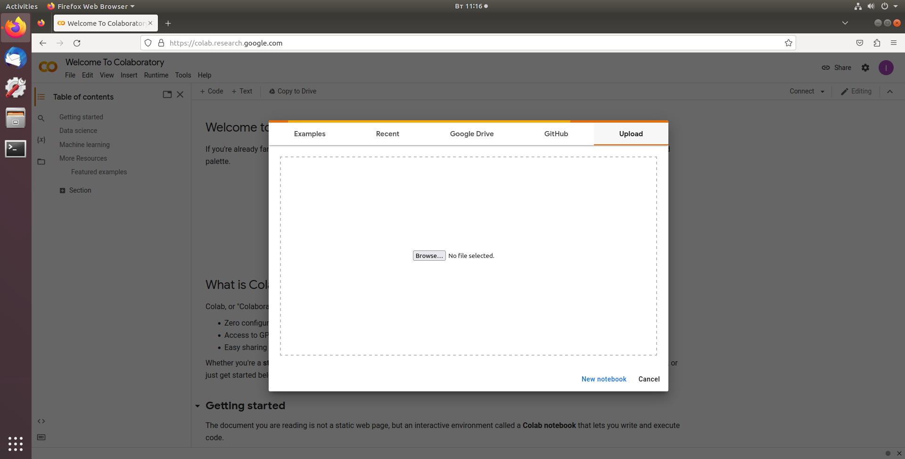
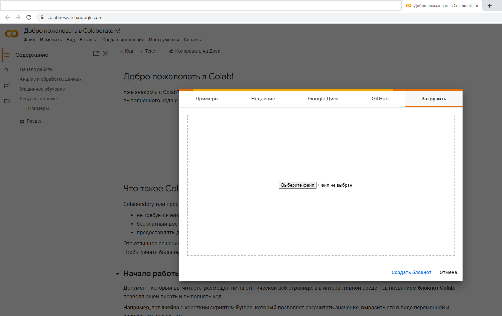

# ximc_device
## Eng

Python wrapper for working with stepper motor controllers using the [libximc](https://pypi.org/project/libximc/) library.

## Running the example on Jupyter Notebook

1. Install the required dependencies. To do this, go to the **scripts** folder and run the script:

   - **install_for_py_36_37.bat** if you work in *Windows* with *Python* version 3.6-3.7;
   - **install_for_py_38_311.bat** if you work in *Windows* with *Python* version 3.8-3.11;
   - **install_for_py_36_37.sh** if you work in *Linux* with *Python* version 3.6-3.7;
   - **install_for_py_38_311.sh** if you work in *Linux* with *Python* version 3.8-3.11.

2. At the prompt, go to the **jupyter_demo** folder and run the command:

   - if you work in *Windows*:

     ```bash
     venv\Scripts\python -m jupyter notebook jupyter_demo.ipynb
     ```

   - if you work in *Linux*:

     ```bash
     venv/bin/python3 -m jupyter notebook jupyter_demo.ipynb
     ```

3. Then follow the instructions from the **jupyter_demo.ipynb** example.

## Running the example on Google Colab

1. Sign in to your Google account in browser.

2. Open [Google Colab](https://colab.research.google.com/) in browser.

3. In the window that appears, select "Upload" and select the file **jupyter_demo.ipynb**.

   

4. Then follow the instructions from the **jupyter_demo.ipynb** example.

## Note

The application has been tested on the following machines:

- *Windows 10*, *Python 3.6.8* (64 bit), *3.7.9* (64 bit), *3.8.10* (64 bit), *3.9.13* (64 bit), *3.10.7* (64 bit), *3.11.1* (64 bit). There is a problem installing Jupyter Notebook on *Python* 32 bit (you can read about the problem, for example, [here](https://stackoverflow.com/questions/67343397/how-to-fix-errors-occurring-on-installation-of -jupyter-notebook)). Therefore, to work, you need to use *Python* 64 bit;
- *Ubuntu 18.04*, *Python 3.6.9*, *3.8.16*, *3.10.9*;
- *Ubuntu 20.04*, *Python 3.8.10*, *3.10.9*, *3.11.1*.


## Rus

Python-обертка для работы с контроллерами шаговых двигателей с помощью библиотеки [libximc](https://pypi.org/project/libximc/).

## Запуск примера на Jupyter Notebook

1. Установите необходимые зависимости. Для этого перейдите в папкy **scripts** и выполните скрипт:
   - **install_for_py_36_37.bat**, если вы работаете в *Windows* с *Python* версии 3.6-3.7;
   - **install_for_py_38_311.bat**, если вы работаете в *Windows* с *Python* версии 3.8-3.11;
   - **install_for_py_36_37.sh**, если вы работаете в *Linux* с *Python* версии 3.6-3.7;
   - **install_for_py_38_311.sh**, если вы работаете в *Linux* с *Python* версии 3.8-3.11.
   
2. В командной строке перейдите в папку **jupyter_demo** и выполните команду:
   - если вы работаете в *Windows*:
   
     ```bash
     venv\Scripts\python -m jupyter notebook jupyter_demo.ipynb
     ```
   
   - если вы работаете в *Linux*:
   
     ```bash
     venv/bin/python3 -m jupyter notebook jupyter_demo.ipynb
     ```
   
3. Далее следуйте инструкции из примера **jupyter_demo.ipynb**.

## Запуск примера на Google Colab

1. В браузере войдите в ваш аккаунт Google.

2. Откройте в браузере [Google Colab](https://colab.research.google.com/).

3. В появившемся окошке выберите "Загрузить" и выберите файл **jupyter_demo.ipynb**.

   

4. Далее следуйте инструкции из примера **jupyter_demo.ipynb**.

## Примечание

Работа приложения была проверена на следующих машинах:

- *Windows 10*, *Python 3.6.8* (64 bit), *3.7.9* (64 bit), *3.8.10* (64 bit), *3.9.13* (64 bit), *3.10.7* (64 bit), *3.11.1* (64 bit). Имеется проблема установки Jupyter Notebook на *Python* 32 bit (о проблеме можно почитать, например, [здесь](https://stackoverflow.com/questions/67343397/how-to-fix-errors-occurring-on-installation-of-jupyter-notebook)). Поэтому для работы нужно использовать *Python* 64 bit;
- *Ubuntu 18.04*, *Python 3.6.9*, *3.8.16*, *3.10.9*;
- *Ubuntu 20.04*, *Python 3.8.10*, *3.10.9*, *3.11.1*.
